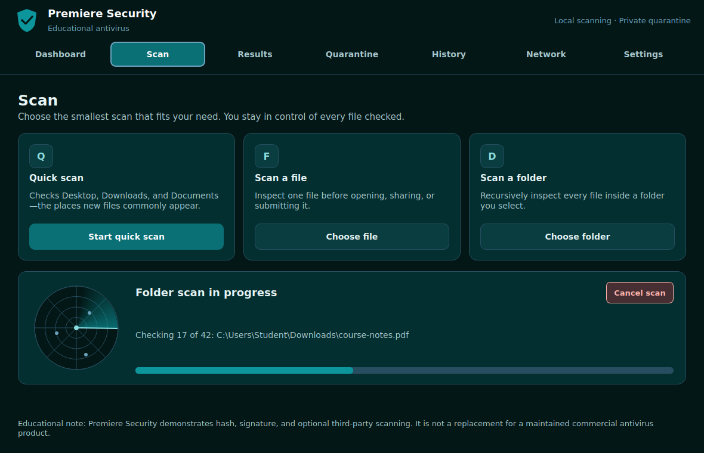
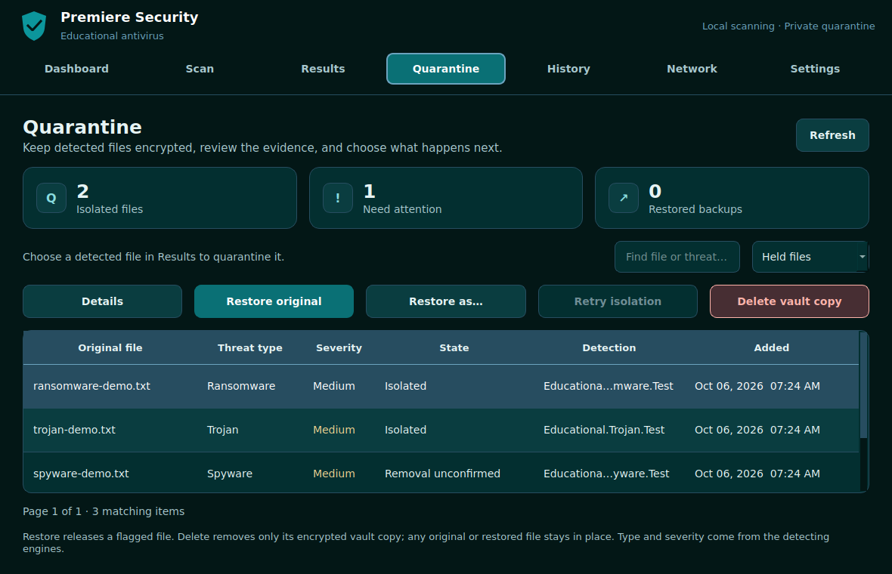

# Premiere Security 1.2

A desktop file-scanning project for Information Assurance and Security (IAS). It combines a PySide6 interface, exact SHA-256 catalogue matching, educational YARA signatures, optional ClamAV, opt-in VirusTotal hash reputation, encrypted quarantine, reports, local history, a CLI and a restricted Flask API.



**Scope:** this is a classroom scanner. A “No matches” result means that the enabled checks found no known signature; it does not prove a file is safe. The application does not execute files or claim to replace a maintained antivirus. Included demonstration files are harmless text.

## Start in VS Code on Windows

Open the repository **root** folder, `IAS-AM`, then use its terminal:

```powershell
py -m venv .venv
.venv\Scripts\python.exe -m pip install --upgrade pip
.venv\Scripts\python.exe -m pip install -r requirements.txt
.venv\Scripts\python.exe -m antivirus.frontend_main
```

These commands work without activating the environment or changing PowerShell execution policy. In VS Code, run **Python: Select Interpreter** and choose `.venv\Scripts\python.exe`.

After closing the app, reopen a terminal in the same root folder and run only:

```powershell
.venv\Scripts\python.exe -m antivirus.frontend_main
```

Python 3.12+ is required. The desktop app runs independently of Flask and Docker. The former `IAS-AM-main` duplicate source tree has been consolidated into this root; its README points here.

## Features

| Workspace | Function |
|---|---|
| Dashboard | Lifetime scan totals, honest engine availability, empty catalogue notice, recent activity |
| Scan | File, recursive folder and Quick scan; background worker; progress; native radar; safe cancellation |
| Results | Status filters, file/detection search, pagination, per-engine details, SHA-256 and durations |
| Quarantine | Manual encrypted isolation, detection type/severity, verification, restore/restore-as, retry and deletion |
| Reports | JSON and CSV exports; CSV formula escaping; signed JSON with trusted-key verification |
| History | SQLite summaries, UTC start/end times, targets, detections, skipped entries and warnings |
| Network | Optional on-demand, read-only connection snapshot without packet capture or process termination |
| Settings | Saved engine preferences, opt-in stable-download monitoring, reduced motion, privacy information |
| CLI / API | Structured reports, useful CLI exit codes, authenticated and folder-restricted API |

All scans are read-only. Choosing **Quarantine selected** explicitly changes files through the separate quarantine service. Optional download monitoring checks stable **new or changed** files, keeps summaries in History and posts a status-bar alert. It does not block file opening or move/delete files. Existing downloads require a manual scan. Monitoring is off by default and stops safely on application close. Changing engine settings stops an existing monitor; enable it again to use the new settings.

Every desktop page uses the reference palette: `#031716`, `#032F30`, `#0A7075`, `#0C969C`, `#6BA3BE`, `#274D60`. Readable light text, amber warnings and a complementary pink danger accent support the ocean theme. Labels communicate meaning independently of color.

## Quarantine



1. Scan a file or folder. In **Results**, select a detected file with a SHA-256 and choose **Quarantine selected**.
2. Confirm isolation. The worker checks the current file against the scan hash, streams it into an AES-256-GCM encrypted vault, verifies the stored content, and only then removes the original.
3. Open **Quarantine** to see the type, highest reported severity, state, detection names, original path, size and SHA-256. Select a row; **Details** shows the full evidence. Hover over the filename for its original path.
4. Choose **Restore original** or **Restore as…** after reviewing the evidence. The service verifies integrity first and never overwrites an existing destination. An encrypted backup remains until you explicitly delete it.
5. **Delete vault copy** removes the encrypted copy and retains the activity record. It leaves original/restored files alone. A failed original removal is labelled **Removal unconfirmed** and offers **Retry isolation**, which reverifies both copies before retrying.

The reported type and threat level come from the detecting engines. Unknown classifications stay unknown; educational markers are harmless demonstrations. The app does not infer a specific virus family or a calibrated probability from a generic detection.

Vault files live in `antivirus_data/quarantine`, or under `ANTIVIRUS_DATA_DIR`. The catalogue records evidence separately from scan history. Payload filenames use random IDs; equal original filenames do not collide. The vault, its keys and its catalogue are excluded from normal scans. Runtime contents and vault keys are ignored by Git.

On **Windows**, the AES key is wrapped by DPAPI for the current Windows account. Folder access inherits the OS account's ACLs. On **POSIX**, directories are mode 0700 and the key, catalogue and payloads are mode 0600; the local AES key file is not itself encrypted. Metadata such as paths and detection labels remains plaintext in the private catalogue. This is protection for stored content within a trusted OS account, not an administrator-resistant sandbox or a way to stop already running malware.

Restore publishes the recovered file without replacement using a hard link in its destination folder. Choose an **NTFS or another hard-link-capable filesystem**. FAT/exFAT or restricted network shares may reject this operation; the encrypted backup stays intact. It does not recreate missing folders or restore executable POSIX permissions. Linked paths, junctions, special files and originals with additional hard links are refused. Actions use the same per-file size limit as scanning and run in the background; closing waits for them to finish.

Back up the **whole vault with the app closed**, including its catalogue, payloads and protected key. Keep that backup private. A missing key cannot recover held contents; the app refuses to silently replace it. Windows recovery needs the original account/DPAPI context as well as the key file. Moving or freshly extracting the source into another folder does not automatically move existing app data. Deletion is ordinary file deletion, not a guarantee of forensic secure erasure on SSDs or backups. See [quarantine design, usage and remaining work](docs/QUARANTINE-GUIDE.md).

## Detection and limits

| Engine | Default | Behavior |
|---|---|---|
| SHA-256 catalogue | On | Exact matching; new installations have an empty catalogue |
| YARA | On | Demonstration markers plus pattern combinations; missing/broken rules make scans incomplete |
| ClamAV | Off in desktop settings; auto-available in headless scanner | Optional local daemon at `127.0.0.1:3310`; errors are not treated as clean |
| VirusTotal | Off | Optional HTTPS hash lookup; never uploads contents; unknown/quota/error states are distinguished |

Files larger than **256 MiB** are skipped. Folder discovery stops at **25,000 files** with a visible warning. Links, junctions and special files are skipped. YARA has a **10-second match timeout**. VirusTotal requests have an **8-second network timeout**, a short in-memory cache and a **15-second minimum interval per service instance**. For bulk scans, leave VirusTotal off; quotas from your provider still apply.

An enabled engine failure produces an error or an incomplete-check warning while retaining any detections from other engines. A scan with no working detection engine does not receive a clean verdict. Missing folders, cancelled scans, empty folders and skipped files remain distinguishable.

## Safe classroom demo

The `demo_samples` directory contains a clean sample and clearly marked demonstration files for ransomware, trojan, worm and spyware. Open **Scan → Choose folder** and select that directory.

To place byte-identical harmless samples in several folders or drives you select:

```powershell
py .\scripts\distribute_demo.py --destination ([Environment]::GetFolderPath('Desktop')) --destination 'E:\' --copies 2
```

This creates separate `IAS-AM-Scan-Demo` folders with nested sample sets. It preserves existing files and never reuses an existing demo folder. Scan each generated folder recursively using **Scan → Choose folder**. See [the multi-location demo guide](docs/MULTI-LOCATION-DEMO.md) for expected counts, hash seeding and USB-drive limitations.

To demonstrate exact hash matching, seed the one harmless catalogue sample:

```powershell
.venv\Scripts\python.exe scripts\prepare_demo.py
```

Scan `demo_samples\hash-match-demo.txt`. Editing its contents changes its SHA-256 and therefore breaks the exact match. The seeded entry is explicitly labelled educational; it is not a malware feed.

See [the IAS engineering review and presentation guide](docs/IAS-ENGINEERING-REVIEW.md) for the complete feature audit, original bugs, all course chapters, a risk register, policies, a recovery procedure and the improvement roadmap.

## Signed reports

On Results, choose **Signed JSON**. The application generates an Ed25519 key pair on first use and signs a canonical JSON representation. Keys live under `antivirus_data/keys` or your configured data directory.

- `report-signing.pem` is the private key. Keep it private.
- `report-public.pem` is the public verification key. Share it through an independently trusted channel.
- The exported bundle includes the report, signature, public key and key fingerprint.

Verify with a public key you already trust:

```powershell
.venv\Scripts\python.exe main.py verify-report report.signed.json --public-key antivirus_data\keys\report-public.pem
```

Changing a report or substituting another key makes verification fail. The embedded key alone does not establish identity. The demo uses a local software key, not a certificate authority or a tamper-proof identity system. The private key is unencrypted; POSIX creation permissions are restricted, while Windows access depends on the account's folder ACLs.

## Optional VirusTotal

Copy `.env.example` to `.env`, add `VIRUSTOTAL_API_KEY`, restart, then enable VirusTotal in Settings. Hashes may identify known confidential files, so opt in only when that is appropriate. Exported reports and history also contain potentially sensitive paths.

## CLI

```powershell
.venv\Scripts\python.exe main.py scan demo_samples\clean.txt
.venv\Scripts\python.exe main.py scan demo_samples --format csv
```

Exit codes: **0** = completed with no matches, **1** = detections found, **2** = error/incomplete/empty/cancelled scan or failed signature verification. If a scan finds a detection and has another failure, the report retains both facts and returns 1; scripts should inspect `summary.incomplete_files` and `warnings` as well.

## Restricted local REST API

The desktop app does not need this API. All `/api/*` routes require a Bearer token; `/health` is public. Without a configured token of at least 32 characters, scanning routes return 503.

Generate a random token:

```powershell
.venv\Scripts\python.exe -c "import secrets; print(secrets.token_urlsafe(32))"
```

Place it in `.env` as `ANTIVIRUS_API_TOKEN`. Set `ANTIVIRUS_API_SCAN_ROOT` to the folder the API is allowed to scan; `.env.example` uses `demo_samples`. Start on localhost:

```powershell
.venv\Scripts\python.exe -m flask --app antivirus.api run --host 127.0.0.1 --port 5000
```

In a separate PowerShell terminal, using your token:

```powershell
$iasToken = Read-Host "API token"
$iasHeaders = @{ Authorization = "Bearer $iasToken" }
$iasBody = @{ target = "clean.txt" } | ConvertTo-Json
Invoke-RestMethod -Uri http://127.0.0.1:5000/api/v1/scan -Method Post -Headers $iasHeaders -ContentType "application/json" -Body $iasBody
```

| Method | Endpoint | Purpose |
|---|---|---|
| GET | `/health` | Server liveness |
| POST | `/api/v1/scan` | Scan a path within the allowed root |
| POST | `/api/v1/scan/batch` | Scan 1–32 validated targets; duplicates are consolidated |
| POST | `/api/v1/report/json` | Scan and return JSON |
| POST | `/api/v1/report/csv` | Scan and download escaped CSV |

Malformed requests return 400; unauthorized requests 401; outside-root or linked paths 403; missing targets 404; oversized bodies 413; busy scanning 429. Every target is validated before a batch starts. Request bodies are capped at 16 KiB and each app instance permits one active scan. API/CLI scans return reports; desktop scans and download monitoring persist history.

This is a local demonstration API using a shared capability token. It has no per-user roles, token expiry or MFA. Keep the development server local; a remote deployment would need a production server, HTTPS termination, per-user authorization, stronger isolation and deployment-wide rate limits.

## Docker

```powershell
docker compose up --build antivirus-api
docker compose --profile test run --rm antivirus-tests
```

Docker publishes only on `127.0.0.1:5000` and mounts `demo_samples` read-only at `/app/scan_targets`. The API token is still required. The visible desktop app runs on the host.

## Validation

```powershell
.venv\Scripts\python.exe -m pytest tests -q
.venv\Scripts\python.exe -m black --check antivirus tests main.py scripts
.venv\Scripts\python.exe -m flake8 antivirus tests main.py scripts
.venv\Scripts\python.exe -m pip check
```

Tests use disposable databases and offscreen Qt. CI is configured for Windows/Linux and Python 3.12/3.13; see the review guide for what was actually run in the review environment. Screenshots show the real widgets with illustrative fixture data, not performance measurements.

## Structure

```text
antivirus/
  config/       Paths, environment loading and resource limits
  controller/   Desktop workflow and scan-history coordination
  detection/    Multi-engine classification and educational YARA rules
  model/        Results, reports, statuses and threat metadata
  repository/   SQLite history and local hash catalogue
  services/     Scanning, engine adapters, reports, signatures and monitoring
  view/         PySide6 pages, radar, navigation and theme
  api.py        Restricted Flask API
  frontend_main.py
scripts/        Harmless hash-demo seeding
demo_samples/   Harmless classroom samples
tests/          Unit, security regression and Qt workflow tests
docs/           Audit, IAS mapping and preview screenshots
main.py         CLI
```
