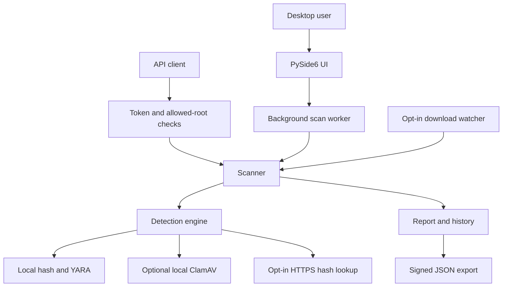

# IAS-AM engineering review and presentation guide

Reviewed baseline: `0947e0d25ae686448e7cbaa068fff9604be39897` from `Alex-AI-Coding/IAS-AM`. Review date: October 5, 2026. The edited application is **Premiere Security 1.1**.

This guide separates verified software behavior, classroom demonstrations, documented designs and future improvements. The course mapping follows **IAS_Module.pdf, IAS 101, PRMSU, First Edition 2025**, found among the available course materials. A project-specific grading rubric was not supplied; the instructor determines whether the evidence meets the assessment requirements.

## 1. What the original project already had

| Original feature | Baseline status | Result of this review |
|---|---|---|
| PySide6 desktop application and shield branding | Implemented at root | Retained; refreshed theme and scrolling pages |
| Dashboard and recent scan activity | Implemented | Honest availability and empty hash-catalogue notices |
| Quick scan | Desktop/Downloads/Documents, then entire-home fallback | Removed unexpectedly broad fallback; explain missing folders |
| Single-file scan | Implemented | Regular-file, size and changed-file checks; engine outcomes |
| Recursive folder scan | Implemented | Missing roots, links, skipped entries and limits made explicit |
| Background worker and cancellation | Implemented | Partial reports retained; completion emitted after thread cleanup |
| SHA-256 hashing and SQLite hash catalogue | Implemented, catalogue initially empty | Streaming safety, empty notice and harmless seeding helper |
| YARA rules | Four malware categories, nine rules | Require explicit educational markers to reduce obvious false positives |
| ClamAV integration | Optional local daemon | Daemon ERROR and malformed responses no longer become clean verdicts |
| VirusTotal hash reputation | Optional, off by default | Validate statistics/hash, distinguish unknown, bound/cache requests |
| Scan result detail and filters | Implemented | Correct check coverage, skip filter, search and 250-row pagination |
| JSON/CSV export | Implemented | Consistent schema, incomplete outcomes, CSV formula escaping |
| Local history and schema migration | Implemented | Start/end times, skipped counts, warnings; migration preserved |
| Scan statistics | Implemented service | Lifetime totals no longer silently capped at 1,000 scans |
| False-positive ratio | Returned a fabricated `0.0` placeholder | Returns unknown until labelled samples exist |
| Saved settings | Implemented | Preserve preferences during outages; prevent zero-engine saves |
| CLI | Implemented | Meaningful exit codes and signature verification command |
| Flask API | Implemented, unauthenticated arbitrary local paths | Bearer authentication, allowed root, validation and workload bounds |
| Docker and Windows setup | Present | Local port binding, read-only targets, simpler VS Code setup |
| Automated backend tests | 57 passing baseline tests | Expanded security and real offscreen Qt workflow tests |
| Nested `IAS-AM-main` copy | Different, partly integrated source tree | Consolidated into the documented root application |
| Download watcher in nested copy | Imported missing dependency; append-open “readiness”; faulty threat check | Stable-file polling, read-only scans, correct detection predicate, opt-in |
| Network/kill-switch UI in nested copy | Extra page with stale indices and blocking work | Read-only asynchronous connection inventory; no process termination |
| Packet inspection in nested copy | Privilege-dependent sniffer; generic words and test addresses | Not represented as a reliable detector; retained as review/history material |
| HTTP/HTTPS proxy in nested copy | Stub returning 501; CONNECT announced success without piping data | Removed from startup; it could not provide the advertised protection |
| Automatic “quarantine” in nested copy | Filename-based rename, collisions/cross-volume problems, detection mismatch | Replaced with alerting; a safe quarantine subsystem remains future work |

Service methods for threat distribution, top threats, detection summary and recent performance remain available. Those analytics are not all exposed as dashboard charts. No rule feed, labelled accuracy dataset or genuine production protection was present.

## 2. Fixed defects and their consequences

| Priority | Original defect | Correction / evidence |
|---|---|---|
| High | Hash/YARA/online failures could leave a CLEAN status | Failures become incomplete results; another engine's detection is retained |
| High | ClamAV daemon ERROR dictionary fell through to clean | Explicit ERROR/unrecognized-response handling |
| High | Public API could scan arbitrary server files | Shared capability token, configured root, resolved containment and link rejection |
| High | Nested watcher compared against nonexistent INFECTED values | Uses `ScanResult.is_detected` and never reports an error as a safe download |
| High | CSV fields could become spreadsheet formulas | Escape untrusted fields beginning with formula/control characters |
| Medium | JSON arrays/scalars caused `.get` failures and HTTP 500 | Require JSON objects; validate complete batches before scanning |
| Medium | Missing batch targets silently disappeared | Return a validation error before performing any part of the batch |
| Medium | Missing folders and disabled engines appeared clean | Explicit error, skipped and empty outcomes |
| Medium | SKIPPED results counted as clean | Separate skipped counter, incomplete metric and result filter |
| Medium | Cancelled reports were discarded | Keep and export partial results with `cancelled=true` |
| Medium | Settings could change engine behavior midway through a scan | Disable settings while the foreground scan owns the worker |
| Medium | Worker completion allowed UI action before thread teardown | Publish results after the thread finishes; avoid destroying live workers |
| Medium | New nested Network page shifted several hard-coded indices | Named page indices in one maintained navigation shell |
| Medium | Download observer tried opening files for append | Stat-based stabilization; read-only scanner callback |
| Medium | Basic spyware words matched ordinary documents | Explicit EDU markers plus combinations; benign-word regression |
| Medium | No per-file/time or discovery limits | 256 MiB files, 25,000 file discovery cap, 10-second YARA timeout |
| Medium | VirusTotal empty/malformed statistics could imply safe | Validate counts; unknown is different from no matches |
| Medium | Temporary service absence overwrote saved preferences | Preserve saved preferences; label unavailable checks clearly |
| Medium | All-time counters only read 1,000 scans | Use complete stored history for totals; recent performance remains bounded |
| Low | Started/completed timestamps were identical placeholders | Store UTC boundaries and measured monotonic durations |
| Low | Many table rows could freeze result rendering | Search and pagination; exports preserve the full report |
| Low | Storage failure could discard otherwise usable results | Retain results and show export/history warning |
| Low | Startup/history storage faults could escape as raw GUI failures | User-facing startup/history recovery messages |
| Low | Slim container lacked Qt runtime libraries for the desktop tests | Explicit Debian variant and offscreen Qt libraries in Dockerfile; runtime build still needs verification |

Files are never executed. Links and special files are skipped, and file identity/size/mtime is rechecked. These checks reduce accidental races; they are not a hardened sandbox against a privileged local attacker changing filesystem objects between engine calls.

## 3. New features

- A native vector radar tied to scan start, completion, failure and cancellation. It stops when hidden or idle and has a reduced-motion setting. Decorative dots are not threat detections.
- A restrained navy/teal/coral interface with neutral surfaces, visible keyboard focus, clear status labels and scrollable pages.
- Searchable, paged results with completed-check coverage and visible incomplete entries.
- Ed25519 signed JSON reports and a verification CLI requiring an independently trusted public key.
- Opt-in monitoring of stable new/changed downloads with local history and status-bar notifications.
- On-demand asynchronous network connection snapshots without payload capture or kill controls.
- Harmless classroom samples for all four rule categories and an exact-hash seeding helper.
- CI configuration for Python 3.12/3.13 on Windows and Linux.

The private signing key is local software key material. On POSIX its creation mode is 0600; on Windows the enclosing account/folder ACL determines access. It is unencrypted. A signature proves integrity relative to a trusted key; it does not by itself prove a person's identity, guarantee nonrepudiation, or certify regulatory compliance.

## 4. IAS course coverage, lesson by lesson

**Code** = a demonstrable implementation. **Partial** = implemented examples plus required explanation/limitations. **Design** = documented concept or procedure, not an implemented product claim.

| Chapter / lesson | Coverage | Evidence or explanation to present |
|---|---|---|
| 1.1 Information assurance | Partial | Reliability, protection/detection/reaction, trustworthy reports; five pillars below |
| 1.2 Information security | Code + explanation | Confidentiality, integrity and availability controls, with explicit limits |
| 1.3 Seven IT domains | Design | Domain mapping below; avoid claiming LAN/WAN protection |
| 1.4 IT security frameworks | Design | NIST CSF mapping; explain ISO/IEC 27001 and COBIT at governance level |
| 1.5 Data classification | Partial | Public demo files; sensitive paths/history; restricted tokens and private keys |
| 2.1 Malicious attacks and threats | Partial | Signature detection, unsafe input/export/race examples; limits of static scanning |
| 2.2 Malicious software | Code | Harmless YARA demonstrations: ransomware, trojan, worm, spyware |
| 2.3 Social engineering | Design | Explain that scanning cannot determine whether a message/person is trustworthy |
| 2.4 Wireless network attacks | Design | Network inventory does not inspect Wi-Fi authentication, encryption or access points |
| 2.5 Web-application attacks | Code + explanation | Authorization, path scope, malformed input, resource limits, safe error responses |
| 3.1 Business impact analysis | Design | Assets, interrupted scan/data loss consequences, priorities below |
| 3.2 Business continuity plan | Partial | Local engines still work without optional cloud services; manual scan fallback |
| 3.3 Disaster recovery plan | Design + exercise | Stop app, back up data, restore, validate and protect signing-key trust |
| 3.4 Compliance and governance | Design | Privacy/retention policy, responsibility, evidence; no compliance certification |
| 4.1 Risk management | Design | Identify assets/threats, assess likelihood/impact, select controls, review residual risk |
| 4.2 Risks, threats and vulnerabilities | Partial | Risk register connects real defects to controls and test evidence |
| 4.3 Operational threat environments | Partial | Offline/online outages, untrusted downloads, metadata exposure and local trust boundary |
| 4.4 Managing and mitigating risk | Code + design | Read-only operation, bounds, reviewable detections and remaining roadmap |
| 5.1 Access-control technology | Code | API credential check and filesystem capability boundary; OS folder permissions |
| 5.2 Formal access-control models | Partial | OS DAC and configured path rules; compare DAC/MAC/RBAC/RuBAC/ABAC below |
| 5.3 Identity management | Partial | Shared-token authentication, scope authorization, scan traceability; no user directory/MFA |
| 6.1 IT security policy infrastructure | Design | Use, privacy, credential, change and response policies below |
| 6.2 SLC and SDLC | Partial | Requirements → design → implementation → regression tests → review → maintenance |
| 7.1 Digital signature standard | Partial | Explain signatures and standards; Ed25519 implementation is not a validated DSS product |
| 7.2 Digital signature format | Code | Canonical JSON, detached signature bytes, public key and fingerprint in a bundle |
| 7.3 Signature applications | Code | Export, trusted-key verification, deliberate report tampering and failed verification |
| 7.4 Authentication service | Code, limited | API bearer capability; possession is not proof of an individual person's identity |
| 7.5 Authentication protocols | Partial | Explain shared bearer secret versus challenge-response/certificates/MFA; those are not built |
| 8.1 IP security | Partial | Read-only connection visibility; no IPsec implementation |
| 8.2 Architecture and protocol | Design | TCP/UDP endpoints, boundary diagram, separation of client/services/storage |
| 8.3 Web-security considerations | Code | Input size/type checks, token, folder scope, no-store, nosniff, sanitized HTTP failures |
| 8.4 SSL and TLS | Partial | VirusTotal HTTPS client uses certificate verification; local API has no remote TLS deployment |
| 8.5 Secure electronic transactions | Design | Explain identity/integrity/confidentiality for a transaction; app has no payments or SET implementation |
| 9.1 Security architecture | Partial | Layered scanner, repositories, UI worker, restricted API; architecture below |
| 9.2 Security management | Design | Owner responsibilities, changes, incident review, residual-risk acceptance |
| 9.3 Resource management | Code | Streaming hash, file/discovery bounds, match/network timeouts, paged UI, active-scan gate |
| 9.4 Security metrics | Partial | Counts and durations exist; true accuracy/FPR require labelled ground truth |
| 9.5 QA and QC | Code + process | Baseline/revised tests, formatting/lint, UI screenshots, review and future CI |

An antivirus project cannot credibly implement every institutional security framework and network protocol. Understanding is shown by explaining what each concept means, which controls demonstrate it, and where other systems/processes are required. If the instructor specifically requires user roles, MFA, encryption at rest or a functioning quarantine, treat those as separate acceptance criteria before claiming completion.

### The five assurance pillars

| Pillar | Evidence in this project | Honest boundary |
|---|---|---|
| Confidentiality | Local scans, no content upload, optional hash lookup, scoped API | History/reports store paths; data is not encrypted at rest; hashes can reveal known files |
| Integrity | SHA-256, stable/changed-file checks, signed reports, parameterized SQLite | Signature is only trustworthy with the right independent verification key |
| Availability | Background work, limits, timeout/error paths, local scan without cloud | No SLA, cluster, sandbox, deployment-wide queue or continuous blocking |
| Authentication | API Bearer token; report public-key verification | No individual accounts, MFA, expiry or identity certificate |
| Nonrepudiation | Signed report can support accountable evidence under key custody | Deletable history/local keys are not a complete nonrepudiation system |

### Seven IT domains

| Domain | Project relationship |
|---|---|
| User | User chooses targets, interprets findings, controls online opt-in |
| Workstation | Primary protected context: desktop files and downloads |
| LAN | Connection visibility is informational; no LAN enforcement |
| LAN/WAN boundary | Local API port and path scope; firewall policy remains external |
| WAN | Optional VirusTotal HTTPS dependency and outages |
| Remote access | Not supplied; explain secure remote administration as a deployment concern |
| System/application storage | SQLite, rules, reports, API key and signing-key custody |

### Access-control comparison

| Model | Meaning | Relation to the demo |
|---|---|---|
| DAC | Owner-controlled permissions | OS account/file permissions protect local data |
| MAC | Centrally enforced security labels | Not implemented |
| RBAC | Permissions by role | Not implemented; viewer/scanner/admin is a future design |
| RuBAC | Access determined by configured rules | API path root and target-type rules provide a simple example |
| ABAC | Decisions using subject/object/context attributes | Not implemented as an identity policy engine |

Do not call a shared API token “RBAC.” Authentication asks who/what holds the credential; authorization asks which resource/action it can access. The current history records scans, not authenticated individual-user activity.

### Framework mapping

For NIST CSF 2.0, use **Govern, Identify, Protect, Detect, Respond, Recover**. The course module's five-function framing predates the additional Govern function. This is an illustrative project mapping, not an assessment or certification:

| Function | Project evidence |
|---|---|
| Govern | Scope, policies, ownership and residual-risk decisions in this guide |
| Identify | Asset classification and risk register |
| Protect | Read-only scans, token, folder scope, secrets outside source |
| Detect | Local hash/YARA and optional engine findings |
| Respond | Review findings, retain/export evidence, involve the responsible administrator |
| Recover | Backup/restore exercise and manual scanning fallback |

ISO/IEC 27001 would require an organizational ISMS beyond this application; COBIT addresses governance of enterprise IT. A few controls or a framework table cannot establish conformance to either.

## 5. Architecture and trust boundaries

The OS account is trusted to manage the program, rules, databases, keys and settings. Untrusted targets are read as data. The API grants one capability to one scan root. External reputation is optional. A signed export adds report integrity relative to an independently trusted key, not file safety or identity certification.

## 6. Risk register

Likelihood/impact are qualitative classroom judgments, not measured probabilities. Reassess them for the actual machine/deployment.

| Risk | Initial assessment | Control / residual issue |
|---|---|---|
| False-clean engine failure | High impact, plausible | Error/coverage states tested; signatures still limited |
| Unauthorized API file reading | High impact, plausible if exposed | Token/root/local bind; leaked token still grants that scope |
| Large or special file stalls | Medium impact, plausible | Regular-file/size/discovery limits; no hostile-native-engine sandbox |
| False-positive demo heuristic | Medium impact, likely for generic words | EDU markers required; no measured real-world accuracy |
| Sensitive filenames in reports | Medium impact, plausible | Local defaults, disclosure, controlled sharing/retention; no redaction UI yet |
| Cloud reputation outage/quota | Medium impact, likely for bulk lookup | Visible errors, cache/spacing, local-only option |
| Signing key copied or lost | High evidence impact, plausible | Private-key custody and backup; no hardware store/encrypted key |
| Incomplete proxy/automatic quarantine | High operational impact | Removed from runtime; no blocking/quarantine claim |
| Privileged local filesystem manipulation | High impact, lower classroom likelihood | Link/identity checks; same-account/privileged attacker remains outside strong isolation |
| Lost history/database corruption | Medium impact, plausible | Export on persistence errors; backup/restore exercise |

## 7. Operational policy and recovery exercise

Use these as project policies to discuss and adapt with the instructor:

1. Scan only files/folders you are authorized to inspect. Demonstrate with harmless samples.
2. Leave VirusTotal and download monitoring off until the user opts in. Never upload file contents.
3. Treat paths, reports, API credentials and keys according to their classification. Never commit `.env`, databases or private keys.
4. Review a suspicious finding before taking action. Educational markers are not evidence of real infection.
5. Keep a copy of important signed reports and record the public-key fingerprint separately. Share a public key through a trusted channel.
6. Review dependencies and rules when changes occur. Record the reason for updates and run the regression suite.
7. Retain history only as long as needed for the exercise; the current UI provides explicit clear-history control. Institutional retention/legal rules need separate determination.

**Business impact:** losing scanner availability interrupts checks; losing history weakens the evidence trail; losing a private key prevents signing with that identity; leaking the key allows forged evidence. These have different priorities and recovery strategies.

**Continuity:** run local checks when the online provider is unavailable. Use an explicit folder scan if Quick scan folders are missing. Export the available results if history storage fails. The monitor does not block a download while it is being checked.

**Recovery drill, on a disposable demo installation:**

1. Close the app/API and wait for workers to finish.
2. Copy `antivirus_data` to an access-controlled backup folder. Include the signing key only in a protected backup; do not add it to a class submission archive.
3. Record a scan count and the signing public-key fingerprint. Preserve one signed report independently.
4. Rename the active data folder, restore the backup to the original path, and restart the app.
5. Confirm the recorded history and rerun a clean/demo scan.
6. Verify the old signed report using the independently retained public key. If the key was compromised, retire it and document a new trusted fingerprint; a new key cannot authenticate old evidence.
7. Record actual recovery time and whether any records were lost. RTO/RPO targets require the instructor/organization's chosen requirements; the app does not invent them.

The backup copy is taken with writers stopped. For live database backups, use SQLite's backup mechanism rather than copying an actively written database file.

## 8. Presentation flow and evidence to collect

| Step | Demonstration | Concept / evidence |
|---|---|---|
| 1 | Explain scope, assets and the five pillars | Show limits alongside controls |
| 2 | Start desktop and inspect engine availability | Empty catalogue and unavailable optional checks are explicit |
| 3 | Scan `clean.txt` | No matches; SHA-256 and completed engines |
| 4 | Scan each EDU demo category | Pattern matching with harmless files |
| 5 | Run `scripts/prepare_demo.py`, scan hash sample, then edit a copy | Exact hash changes when contents change |
| 6 | Scan a multi-file folder and cancel partway | Real radar/progress; exported partial outcome |
| 7 | Use search, filters and pagination | Usability without dropping exported results |
| 8 | Export Signed JSON and verify with the trusted public key | Digital signature integrity |
| 9 | Edit one report field and verify again | Tamper rejection; explain independent key trust |
| 10 | Call API without a token and outside the allowed root | Authentication versus authorization |
| 11 | Opt into download monitoring and create a harmless new file | Stabilization, alerting, privacy, no execution blocking |
| 12 | Refresh the Network page | Visibility versus traffic protection |
| 13 | Show test summary, risk register and recovery drill | QA, operational security and limitations |

Collect your own screenshots, exported reports, test output, configuration with secrets removed, tamper-verification results and recovery notes. Never submit the private signing key or live API key/token.

Useful defense answers:

- **Does a clean result prove safety?** No. It means the enabled completed checks found no known match.
- **Why are hashes not encryption?** A hash is a digest; it does not provide recoverable confidential storage. A signature authenticates data relative to a key; it does not encrypt the data.
- **What happens if an engine fails?** Its outcome is recorded. The file is incomplete unless another engine detects something, in which case that detection and the failure both remain visible.
- **Does the radar detect malware?** It communicates scan activity. Detection comes from the configured engines.
- **Does monitoring prevent opening a malicious download?** No. It is an opt-in, after-write check with alerts, not kernel-level interception.
- **What does a valid signature prove?** That the signed report matches the bytes signed by the trusted key holder, assuming key custody and trust are sound.
- **Is history nonrepudiable?** No. Local SQLite history is deletable and is not bound to individual identities.
- **Why no kill-switch?** A process/port/IP alone is insufficient evidence; incorrect termination can interrupt legitimate work.
- **Do you implement all access-control models?** No. The demo uses OS permissions and an API capability/path policy; other models are explained and identified as future designs.

## 9. Improvement roadmap

These are recommendations to prioritize against the actual rubric, not claims of completed implementation.

| Priority | Improvement | Reason / acceptance evidence |
|---|---|---|
| Before submission | Confirm rubric and team ownership | Map every required item to implemented behavior or a documented limit |
| Before submission | Run on the actual Windows/VS Code machine | Record installation, scaling, file dialogs, cancellation and startup results |
| Before submission | Present key trust and risk/backup exercises | Show understanding beyond a scan animation |
| Before submission | Verify genuine ClamAV/VT if claiming integrations | Use a maintained daemon/key; record errors/outages and source of results |
| High if rubric requires it | Individual accounts and RBAC | Viewer/scanner/admin rights enforced in services, not just hidden buttons |
| High if rubric requires it | MFA and credential lifecycle | Expiry, revocation, secret storage, recovery and distinct identities |
| High if rubric requires it | Safe quarantine/restore | Content-addressed storage, collision handling, atomic moves, metadata, permissions and explicit decisions |
| High | Maintained signed detection feeds | Verify updates, provenance, rollback and version visibility |
| High | Native-engine sandbox | Contain malformed-file parser faults and bound each job |
| High for remote use | Production API + HTTPS + global limits | Production server, worker queue, per-user authorization, TLS, rate limits across processes |
| High for sensitive evidence | Key protection and report/data encryption | OS credential/hardware store or protected private keys; authenticated encryption with recovery |
| Medium | Append-only authenticated audit trail | Identity/action/time attribution, rotation, external retention and deletion policy |
| Medium | Labelled evaluation dataset | Precision, recall, false-positive rate, true negative counts; unknown until measured |
| Medium | Hash/rule catalogue management UI | Validate SHA-256, import provenance, approve updates and show counts/versions |
| Medium | History details/search/export | History currently stores summaries; full reports should be explicitly retained with a privacy policy |
| Medium | Report path redaction and retention | Avoid revealing usernames/documents during classroom sharing |
| Medium | Windows known-folder support | Handle relocated/OneDrive Desktop/Documents/Downloads rather than assuming home subfolders |
| Medium | Live backup/restore tooling | SQLite backup API, validation, encrypted backup and documented recovery timing |
| Medium | Crash recovery and job resumption | Persist job state, recover partial results and distinguish interrupted work |
| Medium | Automated dependency/security audit | Lock/SBOM, vulnerability review and update policy; no “zero vulnerabilities” claim here |
| Medium | More accessible navigation/scaling | Screen-reader testing, high DPI, keyboard-only user trials, varied display sizes |
| Later | Trusted network reputation and incident investigation | Validated data, bounded processing, privacy/privilege controls; avoid generic word/port verdicts |
| Later | Scheduling, analytics and localization | Add only if useful without obscuring the main workflow |

## 10. Visual decisions

Teal near the blue-green part of the color wheel is paired with a complementary orange/coral accent. The dark navy shell gives structure; off-white surfaces keep content readable. Teal carries primary actions, while coral highlights focus and caution. Status text communicates meaning independently of color.

| Role | Color |
|---|---|
| Navigation | `#142E3F` |
| Main action | `#0F766E` |
| Radar highlight | `#5EE4C1` |
| Coral focus | `#C4775F` |
| Coral radar accent | `#E6AB93` |
| Background / cards | `#F1F5F6` / `#FFFFFF` |
| Main / secondary text | `#173442` / `#516774` |

Controls have visible focus states. The radar can be still. Pages scroll at smaller sizes. Result rendering is paged. This is visual QA, not a completed WCAG/screen-reader certification. Screenshots render the real widgets with illustrative fixture data.

## 11. Validation record

Baseline: **57 tests passed** before edits. Final verification results are recorded in `VALIDATION.md` after running the complete suite and quality checks.

The suite includes deterministic engine/HTTP boundaries and real offscreen Qt event loops. Live VirusTotal credentials, a running ClamAV daemon, Docker execution, Windows hardware and the configured GitHub CI jobs were not available to certify here. Network connection access can differ by OS account. Local validation does not establish antivirus efficacy or production security.

## 12. Primary references

- Course scope: `IAS_Module.pdf`, IAS 101, PRMSU, First Edition 2025 (course material; not a project grading rubric).
- [YARA Python match/timeout API](https://yara.readthedocs.io/en/stable/yarapython.html).
- [Qt QThread lifecycle guidance](https://doc.qt.io/qtforpython-6/PySide6/QtCore/QThread.html).
- [OWASP CSV injection](https://community.owasp.org/attacks/CSV_Injection).
- [OWASP REST security](https://cheatsheetseries.owasp.org/cheatsheets/REST_Security_Cheat_Sheet.html).
- [Flask security considerations](https://flask.palletsprojects.com/en/stable/web-security/).
- [VirusTotal file objects and analysis statistics](https://docs.virustotal.com/reference/files).
- [Cryptography Ed25519 signing and verification](https://cryptography.io/en/latest/hazmat/primitives/asymmetric/ed25519/).
- [NIST Cybersecurity Framework 2.0](https://nvlpubs.nist.gov/nistpubs/CSWP/NIST.CSWP.29.pdf).
- [Qt Linux runtime requirements](https://doc.qt.io/qt-6/linux-requirements.html).
- [Official Python slim Bookworm Dockerfile](https://github.com/docker-library/python/blob/master/3.12/slim-bookworm/Dockerfile).
